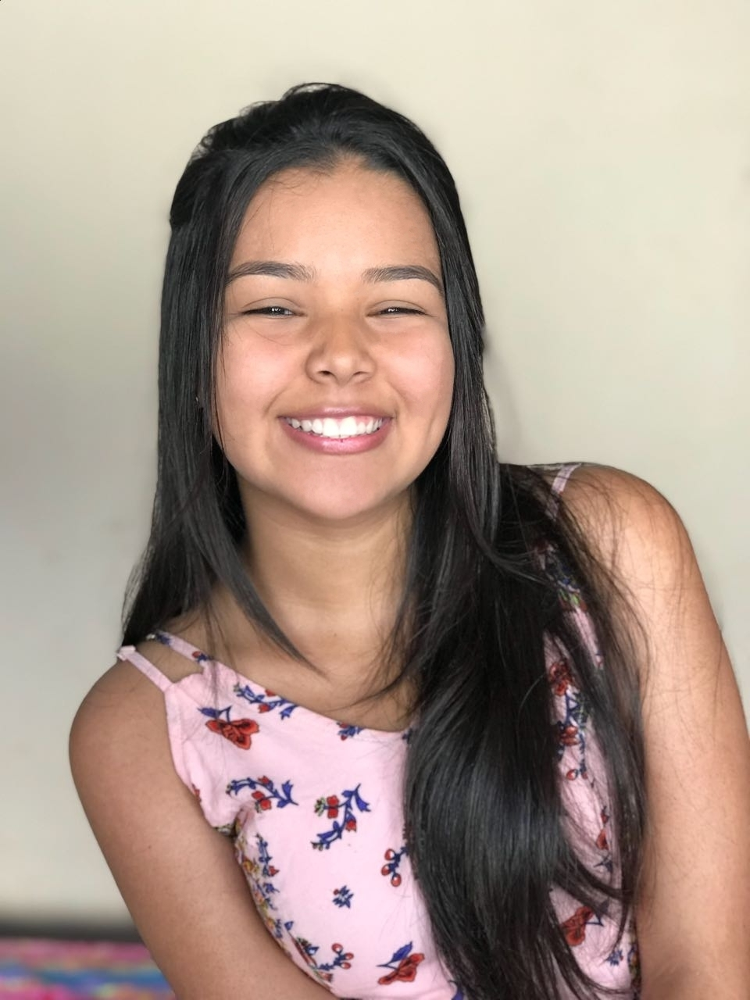
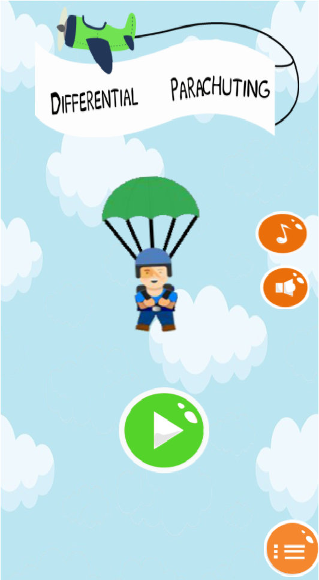
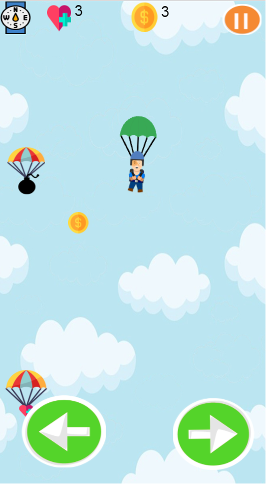
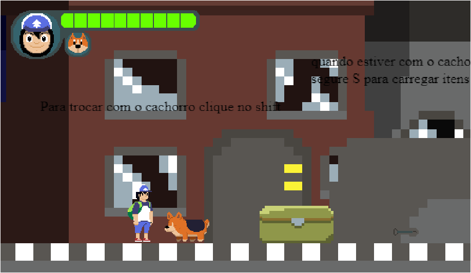

# Meu Portfólio
   
### Alexsandra Silva.

## Um pouco sobre mim...
Meu nome é Alexsandra, porém me chamam de Sandrinha/Fofão, teho 17 anos e estou cursando o técnico integrado em Programação de Jogos digitais no campus Ceará-Mirim.

### JOGOS
#### Primeiro Jogo Produzido:
**Differential Parachuting**: Um jogo sobre coragem onde um paraquedista terá que desviar de objetos que são lançados.
[Jogo](https://armindaa.github.io/JogoDeParaquedismo/)

### Segundo Jogo Produzido
**Differential Parachuting**: Jogo sobre companheirismo, onde se passa em um apocalipse zumbi.
[Jogo](https://pedoronn.github.io/Survival%20Apocalype/)

### ARTES

#### Redes Sociais

1. Instagram: @alexsandrasilvaa_
2. Email: alexsandrasilvaa7@gmail.com
3. Facebook: Alexsandra Silva
