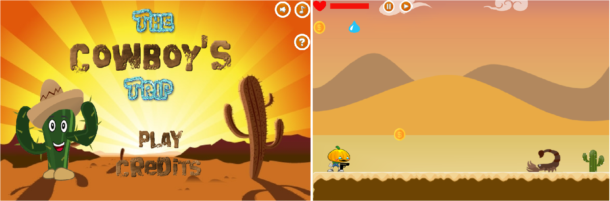
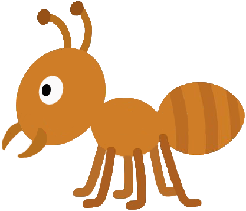
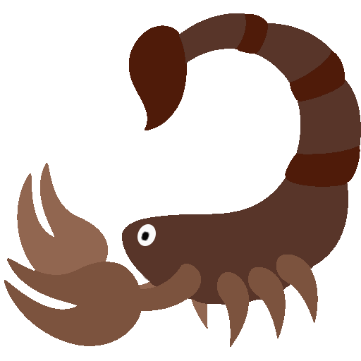

# Seja Bem vindo ao Meu Portfólio
   
### Alexsandra Silva.

## Um pouco sobre mim...
Meu nome é Alexsandra, mas me chamam de Sandrinha/Fofão, teho 17 anos e estou cursando o técnico integrado em Programação de Jogos digitais no campus Ceará-Mirim.

### JOGOS
#### Primeiro Jogo Produzido:
**Differential Parachuting**: Um jogo sobre coragem, onde um paraquedista terá que desviar de objetos que são lançados durante o jogo.

[Clique aqui para jogar](https://armindaa.github.io/JogoDeParaquedismo/)

### Segundo Jogo Produzido
**Survival Apocalipse**: Se trata de um jogo de companheirismo que ocorre em um apocalipse zumbi.

[Clique aqui para jogar](https://pedoronn.github.io/Survival%20Apocalype/)

### Terceiro Jogo Produzido
**The Cowboy’s Trip**: Um jogo sobre temperatura, onde um cabeça de abóbora tenta fugir do deserto.

[Clique aqui para jogar](https://armindaa.github.io/Cowboy/)

### ARTES
![Imagem4](Lançaa.jpg

#### Redes Sociais

1. Instagram: @alexsandrasilvaa_
2. Email: alexsandrasilvaa7@gmail.com
3. Facebook: Alexsandra Silva
